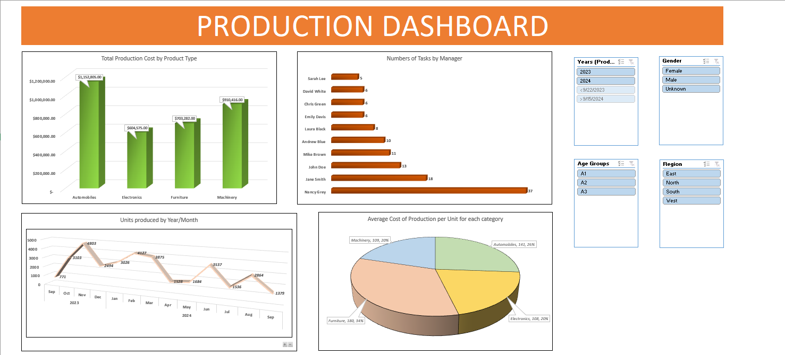

# Production Dashboard - Excel Insights

This repository showcases an **Excel-based dashboard** designed for analyzing production metrics and presenting actionable insights. The file includes a structured dataset, pivot tables, and a comprehensive dashboard for visualization.

## 📂 File Contents

### 1. **Production Dashboard**
   - The main dashboard that visualizes key production metrics.
   - Includes interactive elements and visual summaries for easy data interpretation.

### 2. **Pivot Tables**
   - **Pivot1**, **Pivot2**, **Pivot3**, **Pivot4**: Intermediate tables used to generate insights and support the dashboard. 
   - Enable detailed analysis and allow for quick filtering and summarization of data.

### 3. **Production Dataset**
   - The raw data used as input for analysis.
   - Provides the foundation for pivot tables and the dashboard.

## 🛠️ Features
- **Dynamic Visualizations**: Highlight key performance indicators (KPIs) using charts and graphs.
- **Data Summarization**: Pivot tables condense large datasets into meaningful summaries.
- **Customizable Analysis**: Easily adjust filters and views to explore different aspects of the data.

## Glimes of Dashboard

## 🚀 How to Use
1. Download the Excel file: [Excel+Report+2.xlsx](./Excel+Report+2.xlsx).
2. Open the file in Microsoft Excel (2016 or later recommended).
3. Navigate to the **Production Dashboard** sheet to view the visual insights.
4. Explore pivot tables for detailed analysis and drill-down capabilities.

## 📊 Applications
This dashboard is ideal for:
- Production analysis and tracking.
- Identifying trends and patterns in operational data.
- Decision-making based on visualized KPIs.
